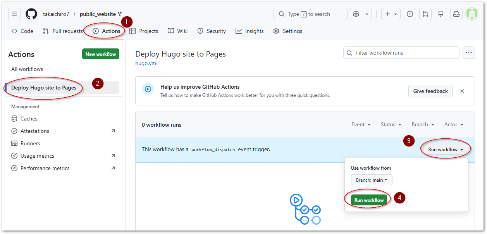
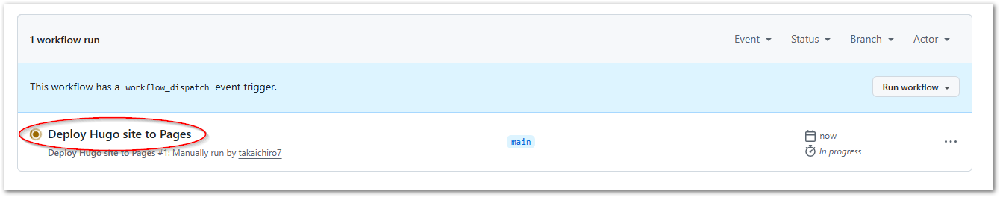
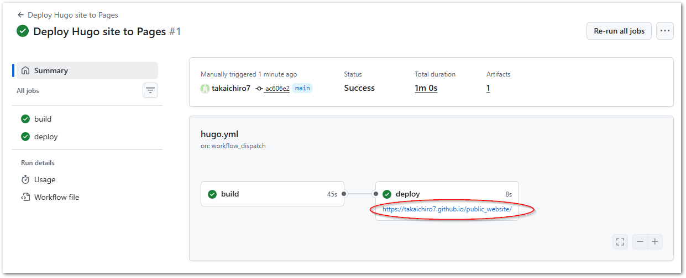

# WMG / WMOC 2027 公式ウェブサイト

このプロジェクトは、主にMarkdownと呼ばれる書式の簡単なテキストフォーマットでリッチなWEBサイトを生成する事ができるフレームワークを用いて World Masters Orienteering Championship 2027 兵庫大会の公式サイトを開発します。

フレームワークには、静的サイトジェネレータである [hugo](https://gohugo.io/) をベースに [hinode](https://gethinode.com/) テーマを用いたウェブサイトとなっています。

編集者の方は、次のツール群でサイトの内容を編集することができます。

* GithubのWEB上から直接編集する場合
    - Githubのアカウントが必要です。こちらからアカウントを作成してください。
    - ブラウザ上でGithubにログインし、その上で直接テキストファイルを編集することができます。
    - テキストの書式は Markdown という書式に則る必要がありますが、あまり複雑ではありません。事前に [このサイト](https://docs.growi.org/ja/guide/getting-started/markdown.html) 等をご覧いただき、書式に慣れておくと良いでしょう。とはいえ、ブラウザ上から直接編集する役割としては翻訳が主となりますので、書式等はあまり気にせず日本語個所を英語にするだけでよいでしょう。

* Github上のプロジェクトファイルを自分のPCに一度ロードして編集する場合
    - Githubアカウントを作成してください
    - Gitクライアント（ Git, TortoiseGit ）
    - テキストエディタ（ [vscode](https://winget.run/pkg/Microsoft/VisualStudioCode) が最も良い ）


## 準備

[このサイトを参照してhugoをインストール](https://gohugo.io/installation/)してください。

たとえばWindowsの場合でwingetを使う場合、コマンドをコマンドターミナルから次のコマンドを入力すろｔインストールできます。

``` powershell
> winget install Hugo.Hugo.Extended
```

## 編集手順

### 初回

次の手順で、wmoc2027組織アカウントの `public_website` リポジトリをご自分のGithubアカウントにForkしてください。

1. 事前にGit/Githubのセットアップを行ってください。
2. [wmoc2027/public_website](https://github.com/wmoc2027/public_website) から自分のリポジトリへフォークします。
3. フォークしたリポジトリのSettingsにアクセスし、`Pages` メニューから、Sources設定を `Github Actions`を選んでください。
   
4. Actionsタブへ移動し、次図のボタン操作を行います。
   
5. `Deploy Hygo site to Pages` のリンクをクリックします。
   
6. Github上であなたのリポジトリ上にWEBサイトを構築するActionsが稼働しています。完了すると次図のとおりリンクが現れますので、クリックしてください。
   

以後、このURLは、あなたが編集を行った結果をGithubリポジトリに反映するたびに自動的ビルドが行われ、インターネット上に公開されるページとなります。

このページは公開用URLとは異なりあなた独自のリポジトリ上のURLですので、下書き用としてWMOC関係スタッフにレビューしてもらうためにご利用ください。

### Github上のリポジトリを自分のPC上で編集する

4. 自分のGithubのリポジトリからローカルにクローンしてください。
5. VS Code等で編集を行いサイトを編集します。この際、次のコマンドでローカルPC上にhugoサーバが起動します。メッセージの最後に現れるURL（[http://localhost:1313/](http://localhost:1313/)）にブラウザでアクセスすることでプレビューを確認することができます。
   ``` powershell
   > hugo server -D
      :
     Running in Fast Render Mode. For full rebuilds on change: hugo server --disableFastRender
     Web Server is available at http://localhost:1313/ (bind address 127.0.0.1)
     Press Ctrl+C to stop
   ```
   VS Codeで上書き保存するたびに自動的に再ビルドが行われ、プレビューに反映されます。編集した結果を確認した上で問題んかえれば適宜コミットを行ってください。
6. ひととおりの編集が終了したら、コミットした変更点をGithub上のリポジトリに反映します。pushを行ってください。
7. Actionsタブを確認し、編集内容をプレビューしてください。またこの結果をWMOC関係者へ公開し、レビューを受けてください。
8. 問題なければフォーク元へプルリクエストを送ってください。

